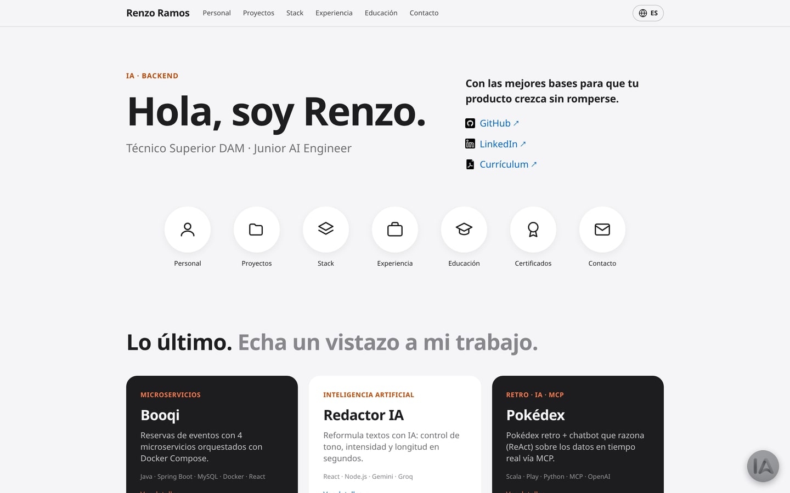
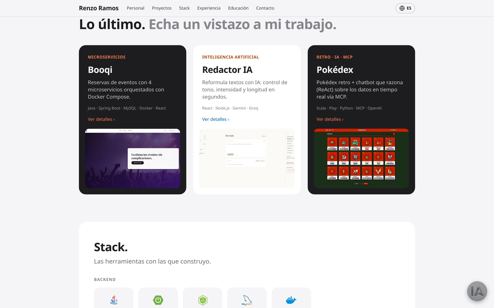
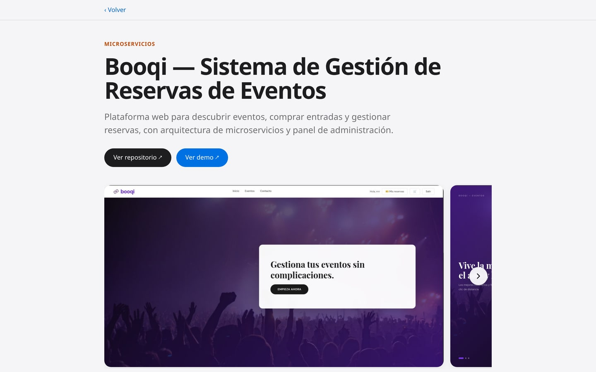
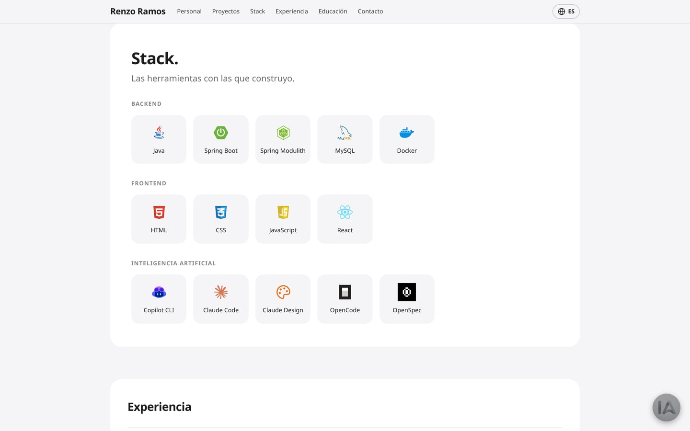
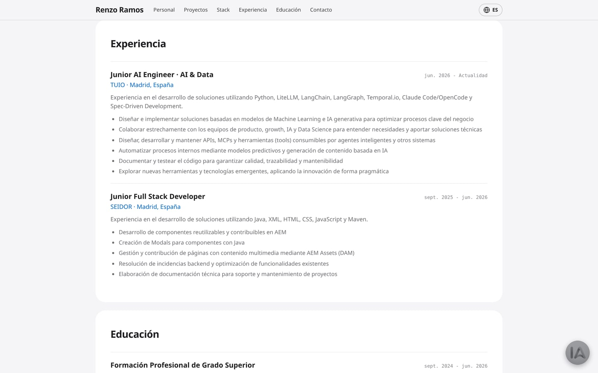
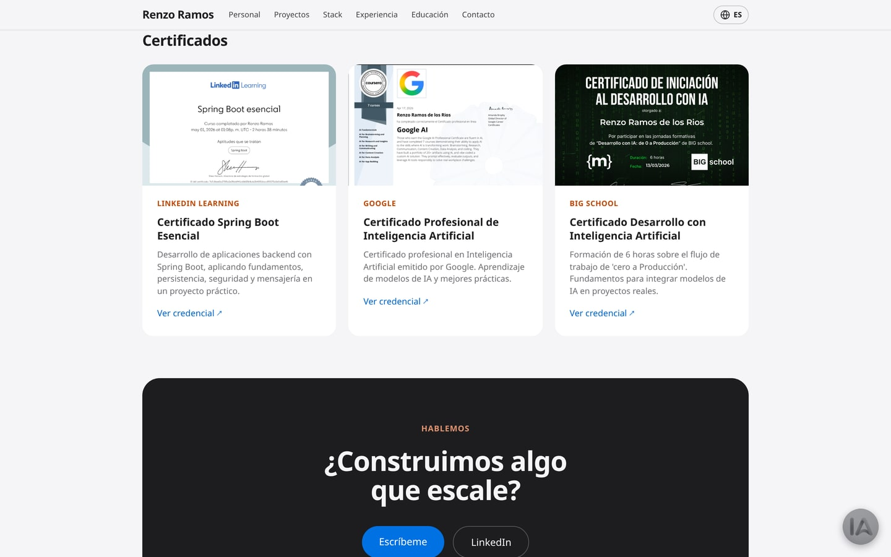
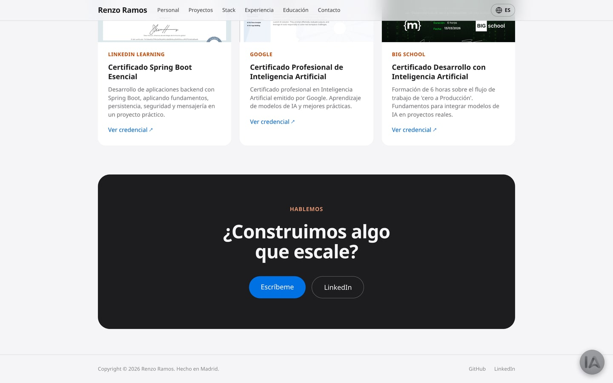

<div align="center">

# Portfolio de Renzo Ramos

**Sitio personal de una sola página, bilingüe y con un asistente de IA que responde sobre mi perfil.**

[**portafolio-renzoramos.com →**](https://portafolio-renzoramos.com)

[](https://github.com/RenzoRamosDEV/Renzo-Ramos-Portafolio/actions/workflows/deploy.yml)
[](https://react.dev/)
[](https://www.typescriptlang.org/)
[](https://vitejs.dev/)
[](https://tailwindcss.com/)
[](https://fastapi.tiangolo.com/)
[](LICENSE)

</div>

> [!NOTE]
> El **asistente de IA está desactivado** en la web publicada: el backend del chatbot no está desplegado. Todo lo demás funciona con normalidad, y el asistente se puede levantar en local siguiendo este README.

---

## El sitio

<div align="center">



</div>

| Proyectos | Ficha de proyecto |
|:---:|:---:|
|  |  |
| Tres proyectos destacados, cada uno con su stack. | Descripción, enlaces al repo y a la demo, y galería navegable. |

| Stack | Experiencia y formación |
|:---:|:---:|
|  |  |
| Agrupado en backend, frontend e IA. | Cronología con puesto, empresa, fechas y responsabilidades. |

| Certificados | Contacto |
|:---:|:---:|
|  |  |
| Vista previa de cada credencial, enlazada al PDF. | Cierre con llamada a la acción y pie de página. |

---

## Características

| | |
|---|---|
| 📜 | **SPA scrollable** con secciones de portada, proyectos, stack, experiencia, educación, certificados y contacto |
| 🌍 | **Bilingüe ES/EN** con cambio instantáneo y persistente en `localStorage` |
| ✨ | **Animaciones** con Framer Motion: reveals al hacer scroll y texto animado palabra a palabra |
| 🤖 | **Asistente de IA flotante** que responde preguntas sobre mi perfil, con backend propio en FastAPI + LangChain + OpenAI |
| 🔍 | **SEO cuidado**: prerender del HTML en build, `sitemap.xml`, `robots.txt`, Open Graph, JSON-LD, `llms.txt` y páginas de aterrizaje indexables |
| 🚀 | **Despliegue automático** a GitHub Pages con dominio propio en cada push a `main` |
| 🛡️ | **Rate limiting** del asistente por IP en el backend, con un contador de cortesía en el frontend |

---

## Arquitectura

El repositorio contiene **dos piezas independientes**:

| Pieza | Ruta | Tecnología | Función |
|---|---|---|---|
| **Frontend** | [`src/`](src/) | React 19 · TypeScript · Vite · Tailwind | SPA estática desplegada en GitHub Pages |
| **Chatbot** | [`chatbot/`](chatbot/) | Python · FastAPI · LangChain · OpenAI | API `POST /chat` que alimenta al asistente |

El frontend es 100 % estático y no tiene backend propio: el asistente consume el del chatbot vía `fetch`, por defecto `http://localhost:8000/chat` en desarrollo.

### Cómo funciona el asistente

1. Al arrancar, el backend concatena todos los `chatbot/knowledge/*.md` y los inyecta en el `SYSTEM_PROMPT`, con reglas anti-inyección. Al ser un prefijo fijo, OpenAI lo cachea y abarata las llamadas.
2. Cada `POST /chat` recibe `{message, thread_id}`. El historial se mantiene por sesión en RAM, acotado a `MAX_HISTORY` mensajes.
3. **Rate limit**: máximo `MAX_QUESTIONS` (6) preguntas por IP cada `RATE_WINDOW` (6 h). Si el LLM falla —por ejemplo, cuota agotada— devuelve un mensaje amable con estado 200.

### Estructura

```
├── index.html                    # Punto de entrada de Vite
├── prerender.js                  # Prerender SSR del HTML en build (SEO)
├── public/                       # Favicons, sitemap, robots, OG image, CNAME…
├── src/
│   ├── main.tsx                  # Render de <App/>
│   ├── App.tsx                   # Monta <PortfolioSite/>
│   ├── entry-server.tsx          # Entrada SSR para el prerender
│   ├── assets/                   # Imágenes y PDFs (stack/ projects/ certs/ cv/)
│   └── portfolio/
│       ├── PortfolioSite.tsx     # Sitio scrollable: secciones + ChatWidget
│       ├── sections/             # Hero · Projects · ProjectDetail · Stack
│       │                           ExperienceEducation · Certificates · Contact
│       ├── components/
│       │   ├── layout/           # Navbar, Footer
│       │   ├── ui/               # Chip, PillButton, ScrollIndicator, SectionTitle
│       │   ├── motion/           # WordsPullUp
│       │   └── chat/             # ChatWidget + useChat + markdown + CSS
│       ├── data/                 # Datos bilingües: projects, experience, stack…
│       ├── i18n/                 # LanguageContext + translations
│       ├── hooks/                # useInView
│       └── styles/               # globals.css (Tailwind)
└── chatbot/
    ├── server.py                 # FastAPI: endpoint POST /chat
    ├── config.py                 # Modelo, límites, CORS
    ├── knowledge.py              # Carga knowledge/*.md → SYSTEM_PROMPT
    ├── llm.py                    # Llamada a OpenAI + mensajes de error
    ├── history.py                # Historial por sesión (RAM)
    ├── ratelimit.py              # Límite por IP (ventana deslizante)
    ├── schemas.py                # Modelos Pydantic
    └── knowledge/                # Base de conocimiento en Markdown
```

---

## Puesta en marcha

**Requisitos:** Node.js ≥ 20 y npm. Para el chatbot, además, Python ≥ 3.10 y una API key de OpenAI.

### Frontend

```bash
npm install
npm run dev        # → http://localhost:5173
```

### Chatbot

```bash
cd chatbot
python3 -m venv .venv
.venv/bin/pip install -r requirements.txt
cp .env.example .env               # rellena OPENAI_API_KEY y SYSTEM_PROMPT
.venv/bin/uvicorn server:app --port 8000
```

El frontend apunta a `http://localhost:8000/chat` (ver [`useChat.ts`](src/portfolio/components/chat/useChat.ts)). Con ambos procesos corriendo, el asistente funciona en local.

### Scripts

| Script | Qué hace |
|---|---|
| `npm run dev` | Servidor de desarrollo de Vite |
| `npm run build` | `tsc` + build cliente + build SSR + prerender a `dist/` |
| `npm run build:spa` | Build solo SPA, sin prerender |
| `npm run preview` | Previsualizar el build de producción |

---

## Guía rápida de edición

| Quiero… | Toco… |
|---|---|
| Editar textos o traducciones | `src/portfolio/data/*` y `src/portfolio/i18n/translations.ts` |
| Añadir un proyecto | `src/portfolio/data/projects.ts` + imágenes en `src/assets/projects/` |
| Añadir tecnología al stack | `src/portfolio/data/stack.ts` + icono en `src/assets/stack/` |
| Editar experiencia o formación | `src/portfolio/data/experience.ts`, `education.ts` |
| Añadir un certificado | `src/portfolio/data/certificates.ts` + PDF en `src/assets/certs/` |
| Editar la UI del asistente | `src/portfolio/components/chat/` |
| Editar lo que **sabe** el asistente | `chatbot/knowledge/*.md` — un `.md` nuevo se añade solo |
| Editar la lógica del asistente | `chatbot/server.py` y módulos vecinos |

### Variables de entorno del chatbot

En `chatbot/.env`, que **nunca se sube a git**. Hay plantilla en [`chatbot/.env.example`](chatbot/.env.example).

| Variable | Obligatoria | Descripción |
|---|:---:|---|
| `OPENAI_API_KEY` | ✅ | API key de OpenAI |
| `OPENAI_MODEL` | ❌ | Modelo a usar (por defecto `gpt-4o-mini`) |
| `SYSTEM_PROMPT` | ✅ | Prompt de sistema con las reglas; el conocimiento se inyecta dentro |

### Estado en `localStorage`

| Clave | Contenido |
|---|---|
| `pf-lang` | Idioma del sitio: `'es'` \| `'en'` |
| `pf-chat-thread` | ID de conversación del asistente |
| `pf-chat-msgs` | Mensajes visibles del chat, que persisten al recargar |
| `pf-chat-rate` | Contador de cortesía del rate limit; la barrera real es el backend |

---

## Despliegue

El frontend se despliega solo a **GitHub Pages** con [`deploy.yml`](.github/workflows/deploy.yml) en cada push a `main`:

1. `npm ci` + `npm run build`, que incluye el prerender para SEO.
2. Se publica `dist/` bajo el dominio propio [portafolio-renzoramos.com](https://portafolio-renzoramos.com), configurado en `public/CNAME`.

El chatbot es un servicio aparte y no forma parte de este despliegue.

---

## Licencia

El **código** está bajo licencia [MIT](LICENSE): úsalo, modifícalo y distribúyelo libremente manteniendo el aviso de copyright.

> [!IMPORTANT]
> **Excepción — contenido personal.** Los textos del portfolio, la base de conocimiento del asistente (`chatbot/knowledge/`), el CV, las imágenes, capturas, logotipos y certificados son contenido personal de Renzo Ramos y **no** están cubiertos por la licencia MIT. Si haces un fork para tu propio portfolio, sustituye todo ese contenido por el tuyo.

---

## Autor

**Renzo Ramos** — Técnico Superior DAM · Junior AI Engineer (Madrid, España)

[🌐 portafolio-renzoramos.com](https://portafolio-renzoramos.com) · [📧 renzoramosivan@gmail.com](mailto:renzoramosivan@gmail.com) · [💼 LinkedIn](https://linkedin.com/in/renzoinv04) · [🐙 GitHub](https://github.com/RenzoRamosDEV)

<div align="center">

⭐ Si te sirve como referencia, una estrella siempre se agradece.

</div>
